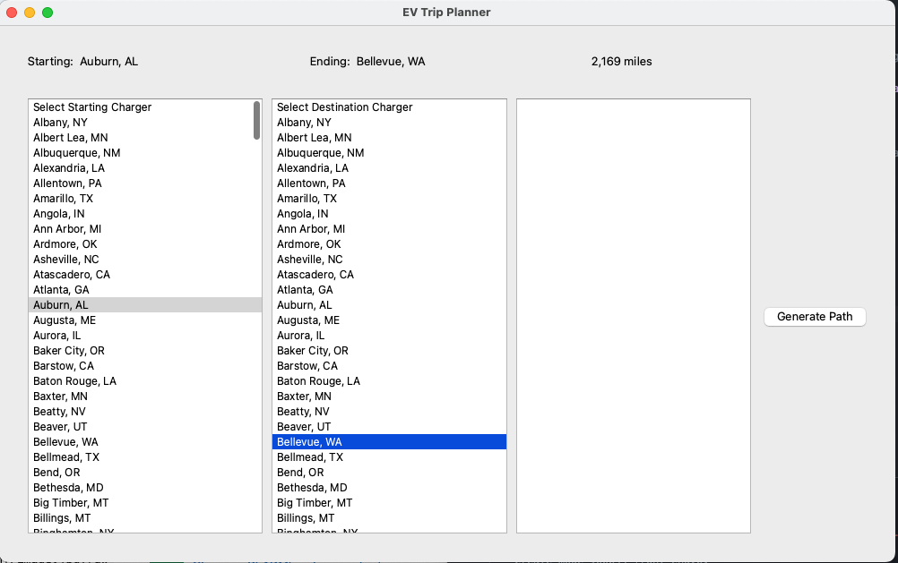
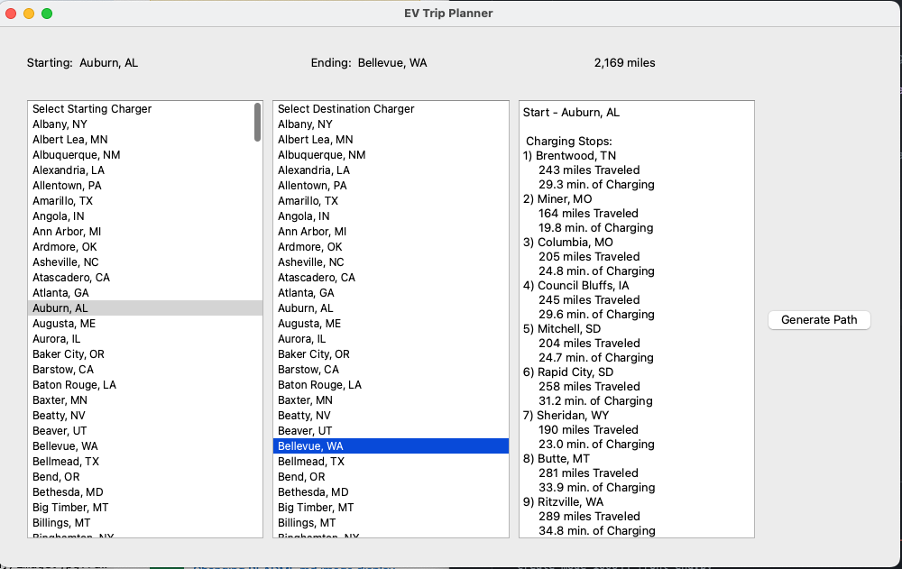

# EVTripPlanner

## Background

This program will take a CSV file that has names and locations (by GPS coordinates: latitude and longitude) and parse the CSV file to create a network of chargers.
Then the user will choose two names of chargers within the network/CSV file and the program will return the shortest route between those two points, giving you the necessary charger stops and charging times at each charger on your way to the destination.

The program assumes that your hypothetical electric car has a fixed range and the path route will be depended on the vehichle's range

Currently, the vehicle range that it is using is 300 miles of range. 

## Running the program 

python main.py 

This will bring up the GUI. You can click on different starting and ending Chargers and it will calculate the distance between those two locations.

Once you have decided on your starting and ending Chargers, click the 'Generate Path' button to the right and it will output the shortest path and all the required charging stops along the way. It will also tell you how far you need to travel to get to each stop as well as the estimated charging time.

